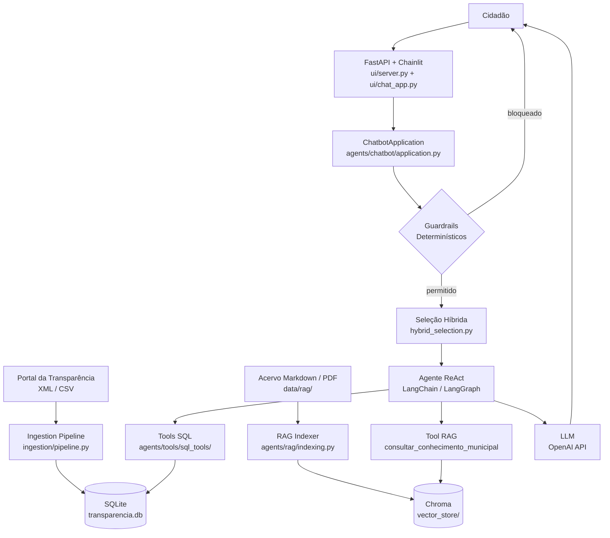
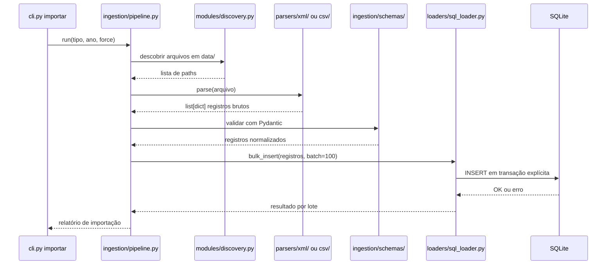
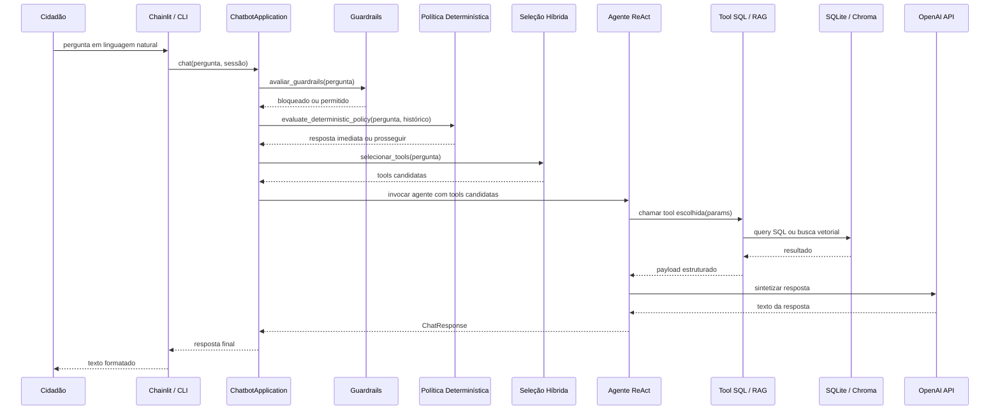
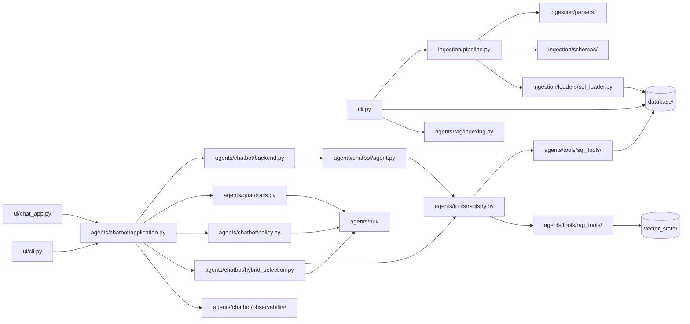

# Como Funciona

## Visão Geral da Arquitetura

O Arcos Transparente é uma pilha `XML/CSV → parser → schema → SQLite → tools SQL + RAG → agente LangChain → FastAPI + Chainlit`. Os dados públicos do portal da transparência de Arcos (MG) são ingeridos por um pipeline offline e normalizados em um banco SQLite relacional. Quando um cidadão faz uma pergunta via interface web, um agente ReAct (LangChain + LangGraph) seleciona as tools adequadas, executa queries SQL ou recuperação semântica, e devolve a resposta em linguagem natural.

A camada de agente expõe **39 tools públicas** organizadas por domínio (servidores e folha, contratos, licitações, despesas, receitas, planejamento, frota, patrimônio, estoques, quadro de pessoal, eleitos, transferências financeiras e conhecimento municipal). Cada domínio tem pelo menos uma tool de consulta/listagem e uma de agregação/ranking. Uma tool RAG (`consultar_conhecimento_municipal`) cobre o acervo markdown curado de telefones, horários de ônibus (intermunicipais e do Tarifa Zero), estrutura organizacional e FAQ.

Antes de cada pergunta chegar ao modelo, um sistema de guardrails determinísticos rejeita perguntas fora do escopo, vazias ou com tentativa de injection. Uma política de seleção híbrida reduz a superfície de tools candidatas entregue ao agente, melhorando a precisão das escolhas. A roteabilidade das tools vem da metadata de cada tool (`routing_metadata`) consumida pelo seletor; a camada de NLU (`agents/nlu/`) faz a leitura estruturada da pergunta (`QueryReading`) e expõe poucos predicados de intenção determinísticos (`agents/nlu/intents.py`) para as distinções genuinamente ambíguas.

As interfaces de usuário vivem no pacote `ui/`, separado do pacote `agents/` — que permanece agnóstico de qualquer UI. A interface padrão é um app FastAPI (`ui/server.py`) que serve a landing institucional (Jinja2 + Tailwind) em `/` e monta o chat Chainlit (`ui/chat_app.py`) em `/chat`; há também uma CLI de chat (`ui/cli.py`, acessível por `python -m ui`). O runtime completo pode ser executado em Docker com um único `docker compose up app`, que executa bootstrap automático (`db init`, `importar`, `rag index`) antes de subir o app via uvicorn.



---

## Fluxo de Ingestão de Dados

O pipeline de ingestão (`ingestion/pipeline.py`) descoberta arquivos em `data/xml/` e `data/csv/`, delega para o parser correto de cada domínio, valida os registros com schemas Pydantic e persiste em lotes de 100 via SQLAlchemy dentro de transações explícitas. Falha em um lote faz rollback apenas daquele lote; os demais continuam. O schema é criado/atualizado via Alembic antes da carga.

Todos os XMLs são lidos respeitando BOM e a declaração `encoding` do cabeçalho. CSVs usam `ISO-8859-1` como compatibilidade padrão com exports do portal. Caracteres de controle inválidos são removidos antes do parse e antes da persistência.



---

## Fluxo de Consulta e Agente

Quando o cidadão envia uma pergunta, o runtime executa as camadas em ordem antes de acionar o LLM. Guardrails determinísticos bloqueiam perguntas fora do escopo, vazias ou com injection. A política determinística resolve continuações curtas e siglas ambíguas. A seleção híbrida mapeia a pergunta para um subconjunto pequeno de tools candidatas usando embeddings e hints de metadata. O agente recebe esse subconjunto e a pergunta, e orquestra chamadas a tools SQL ou RAG até construir a resposta final.



---

## Mapa de Dependências entre Módulos



---

## Estrutura do Projeto

```text
arcos-transparente/
├── cli.py                          # Entrypoint CLI (Typer): db, importar, rag
├── alembic.ini                     # Configuração do Alembic
├── pyproject.toml                  # Dependências e metadados do projeto
├── compose.yaml                    # Docker Compose
├── Dockerfile                      # Imagem Docker do projeto
├── docker/
│   └── entrypoint.sh               # Bootstrap automático do container (db init, importar, rag index)
│
├── database/
│   ├── models/                     # Modelos SQLAlchemy (um arquivo por domínio)
│   ├── session.py                  # Fábrica de sessão SQLAlchemy
│   └── migrations/
│       └── versions/               # Migrations Alembic versionadas
│
├── ingestion/
│   ├── pipeline.py                 # Orquestrador principal de ingestão
│   ├── loaders/
│   │   └── sql_loader.py           # Carga em lotes com transações explícitas
│   ├── parsers/
│   │   ├── xml/                    # Parsers XML por domínio (contratos, licitações, etc.)
│   │   └── csv/                    # Parsers CSV (diárias, passagens, emendas, etc.)
│   ├── schemas/                    # Schemas Pydantic de validação por domínio
│   └── modules/                    # Módulos de ingestão por tipo (discovery + orquestração)
│
├── agents/
│   ├── guardrails.py               # Guardrails determinísticos pré-modelo
│   ├── nlu/                        # Compreensão de linguagem natural (sem router)
│   │   ├── reading.py              # QueryReading: fatos estruturados da query do cidadão
│   │   ├── extractors/             # Extração de entidades por escopo (text, planejamento, contratos, ...)
│   │   ├── detectors.py            # Detectores determinísticos por domínio
│   │   ├── intents.py              # Predicados de intenção p/ a seleção híbrida
│   │   ├── conversation.py         # Normalização conversacional e confirmações
│   │   ├── constants.py            # Palavras-chave de escopo e patterns globais
│   │   └── models.py               # GuardrailDecision
│   ├── chatbot/                    # Núcleo do chatbot, agnóstico de UI
│   │   ├── agent.py                # Bootstrap do agente LangChain + provider de observabilidade
│   │   ├── application.py          # ChatbotApplication: caso de uso de conversa (sem framework)
│   │   ├── backend.py              # ChatbotAgentBackend: executa o agente
│   │   ├── _shared.py              # Tipos compartilhados (ChatMessage, ChatResponse, ChatSession)
│   │   ├── core.py                 # Shim de compatibilidade que reexporta a API pública
│   │   ├── policy.py               # Política determinística pré-seleção
│   │   ├── hybrid_selection.py     # Seleção híbrida de tools candidatas por embedding + hints
│   │   ├── streaming.py            # Extração de chunks de streaming do agente
│   │   └── observability/          # Provider plugável de observabilidade (noop / LangSmith)
│   ├── tools/
│   │   ├── registry.py             # Registro e descoberta de tools (@register decorator)
│   │   ├── sql_tools/              # Tools SQL públicas por domínio
│   │   │   ├── shared/             # Helpers compartilhados entre tools SQL
│   │   │   ├── servidores/         # consultar_servidores, agregar_servidores, consultar_historico_funcional_servidor
│   │   │   ├── contratos/          # consultar_contratos, agregar_contratos, consultar_itens_adquiridos_contrato
│   │   │   ├── licitacoes/         # consultar_licitacoes, agregar_licitacoes
│   │   │   ├── planejamento/       # consultar_planejamento, agregar_planejamento
│   │   │   ├── despesas/           # consultar_despesas, agregar_despesas
│   │   │   ├── receitas/           # consultar_receitas, agregar_receitas
│   │   │   ├── folha_pagamento/    # buscar_historico_*, consultar/agregar_folha_cargos, consultar/agregar_folha_lotacoes
│   │   │   ├── eleitos/            # consultar_eleitos
│   │   │   ├── frotas/             # consultar_frota, agregar_frota, consultar_despesas_frota
│   │   │   ├── estoques/           # consultar_estoques, agregar_estoques, consultar_movimentacoes_de_estoque
│   │   │   ├── patrimonios/        # consultar_patrimonios, agregar_patrimonios
│   │   │   ├── quadro_pessoal/     # consultar_quadro_pessoal, agregar_quadro_pessoal
│   │   │   ├── diarias/            # consultar_diarias, agregar_diarias
│   │   │   ├── passagens/          # consultar_passagens, agregar_passagens
│   │   │   ├── despesas_por_funcao/# consultar_despesas_por_funcao, agregar_despesas_por_funcao
│   │   │   └── transferencias_financeiras/ # consultar_transferencias_financeiras, agregar_transferencias_financeiras
│   │   └── rag_tools/
│   │       └── consultar_conhecimento_municipal.py  # Recuperação semântica no acervo markdown
│   └── rag/
│       ├── indexing.py             # Indexação do acervo markdown/PDF no Chroma
│       ├── retrieval.py            # Retrieval semântico
│       ├── config.py               # Configuração do diretório de persistência do Chroma
│       └── scope.py                # Filtros de escopo do acervo RAG
│
├── ui/                             # Interfaces de usuário (agents/ é agnóstico de UI)
│   ├── __main__.py                 # Entrypoint `python -m ui` → CLI de chat
│   ├── cli.py                      # Interface CLI de chat
│   ├── server.py                   # App FastAPI: landing em / + Chainlit em /chat
│   ├── chat_app.py                 # Target Chainlit (on_chat_start / on_message)
│   ├── errors.py                   # friendly_error_message (UI-agnóstico)
│   ├── templates/                  # Landing Jinja2 (index.html)
│   └── static/                     # CSS/JS da landing (app.css, landing.js)
│
├── shared/
│   ├── utils/
│   │   └── validation.py           # Helpers de parsing reutilizados (parse_int, parse_month)
│   └── runtime_config.py           # Resolução de caminhos e variáveis de runtime
│
├── data/
│   ├── xml/                        # Arquivos XML do portal da transparência (por domínio)
│   └── rag/
│       ├── md/                     # Acervo markdown curado (telefones, horários de ônibus incl. Tarifa Zero, FAQ, etc.)
│       └── pdf/                    # Documentos PDF curados (PMS, regimento interno, etc.)
│
├── vector_store/                   # Artefatos persistidos do Chroma (gerado por `rag index`)
├── database/                       # Banco SQLite (gerado por `db init`)
└── tests/
    ├── agents/                     # Testes do chatbot, guardrails, intents e seleção híbrida
    ├── parsers/                    # Testes unitários de parsers XML e CSV
    ├── pipeline/                   # Testes de integração do pipeline
    └── loaders/                    # Testes do loader SQL
```

---

## Superfície Pública de Tools

O agente cidadão enxerga 39 tools públicas distribuídas por domínio:

| Tool | Domínio | Tipo |
|------|---------|------|
| `consultar_servidores` | Servidores | Listagem / filtro |
| `agregar_servidores` | Servidores | Contagem / ranking |
| `consultar_historico_funcional_servidor` | Servidores | Dados funcionais (admissão, cessão, vínculo) |
| `buscar_historico_de_pagamentos_do_servidor` | Folha de pagamento | Histórico individual |
| `consultar_folha_cargos` | Folha de pagamento | Listagem por cargo |
| `agregar_folha_cargos` | Folha de pagamento | Ranking / totais por cargo |
| `consultar_folha_lotacoes` | Folha de pagamento | Listagem por lotação/secretaria |
| `agregar_folha_lotacoes` | Folha de pagamento | Ranking / totais por lotação |
| `consultar_contratos` | Contratos | Listagem / filtro |
| `agregar_contratos` | Contratos | Contagem / ranking |
| `consultar_itens_adquiridos_contrato` | Contratos | Itens comprados por contrato |
| `consultar_licitacoes` | Licitações | Listagem / filtro |
| `agregar_licitacoes` | Licitações | Contagem / ranking |
| `consultar_planejamento` | Planejamento | Listagem / filtro |
| `agregar_planejamento` | Planejamento | Totais / ranking |
| `consultar_receitas` | Receitas | Listagem / filtro |
| `agregar_receitas` | Receitas | Totais / ranking |
| `consultar_despesas` | Despesas | Listagem / filtro |
| `agregar_despesas` | Despesas | Totais / ranking |
| `consultar_despesas_por_funcao` | Despesas por função | Listagem por função de governo |
| `agregar_despesas_por_funcao` | Despesas por função | Totais / ranking por função |
| `consultar_transferencias_financeiras` | Transferências / emendas | Listagem / filtro |
| `agregar_transferencias_financeiras` | Transferências / emendas | Totais / ranking |
| `consultar_frota` | Frota | Dados cadastrais de veículos |
| `agregar_frota` | Frota | Ranking / totais por tipo ou secretaria |
| `consultar_despesas_frota` | Frota | Histórico de manutenção e gastos por veículo |
| `consultar_diarias` | Diárias | Listagem / filtro |
| `agregar_diarias` | Diárias | Totais / ranking |
| `consultar_passagens` | Passagens | Listagem / filtro |
| `agregar_passagens` | Passagens | Totais / ranking |
| `consultar_estoques` | Estoques | Saldos sumarizados |
| `agregar_estoques` | Estoques | Totais / ranking |
| `consultar_movimentacoes_de_estoque` | Estoques | Histórico diário de movimentações |
| `consultar_patrimonios` | Patrimônios | Listagem / filtro |
| `agregar_patrimonios` | Patrimônios | Contagem / ranking |
| `consultar_quadro_pessoal` | Quadro de pessoal | Listagem / filtro |
| `agregar_quadro_pessoal` | Quadro de pessoal | Contagem / ranking |
| `consultar_eleitos` | Eleitos | Lookup |
| `consultar_conhecimento_municipal` | Acervo markdown / RAG | Recuperação semântica |

Para detalhes de arquitetura de tools, registro e como adicionar novos domínios, consulte [docs/arquitetura-agent-tools.md](./arquitetura-agent-tools.md).

Para a modelagem completa do banco, consulte [docs/database.md](./database.md).
